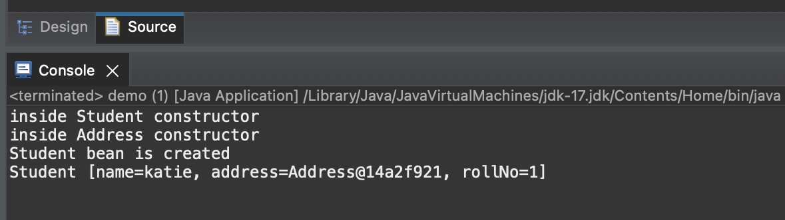

#Spring-Java-framework

Spring FW is used for building enterprise Java apps. Core features: 
- Dependency injection : allows objects to be configured and wired together
- Aspect-Oriented Programming: allows the separation of cross-cutting concerns from business logic. 
- Inversion of Control: when spring is doing dependency injection on our behalf. There are two options : via bean.xml and via annotations

**bean.xml**
Spring maintains a container ( also called ApplicationContext/BeanFactory). When you run the program, Spring would check for bean.xml for which classes you specify to create a bean and create that bean inside the container. At anytime, when you use .getBean(bean_name) method, Spring will fetch the bean created in its container and provides to you
```java
Student st = (Student).getBean(Student);
```
For example, inside resource folder, we have "factoryBean.xml" file: 

```xml
<?xml version="1.0" encoding="UTF-8"?>
<beans xmlns="http://www.springframework.org/schema/beans"
		xmlns:xsi="http://www.w3.org/2001/XMLSchema-instance"
		xsi:schemaLocation="http://www.springframework.org/schema/beans
							http://www.springframework.org/schema/beans/spring-beans.xsd">
	<bean id = "address" class ="Address">
		<property name ="city" value ="Hanoi" />
		<property name ="postcode" value ="10000"/>
		</bean>
		
		<bean id = "student" class="Student">
		<property name ="rollNo" value="1"/>
		<property name = "name" value ="katie"/>
		<property name = "address" ref = "address"/>
	</bean>
</beans>
```
Also, in pom.xml, we add spring-context dependency : 
```xml
<project xmlns="http://maven.apache.org/POM/4.0.0" xmlns:xsi="http://www.w3.org/2001/XMLSchema-instance" xsi:schemaLocation="http://maven.apache.org/POM/4.0.0 https://maven.apache.org/xsd/maven-4.0.0.xsd">
  <modelVersion>4.0.0</modelVersion>
  <groupId>com.spring</groupId>
  <artifactId>Demo</artifactId>
  <version>0.0.1-SNAPSHOT</version>
  <dependencies>
  	<dependency>
  		<groupId>org.springframework</groupId>
  		<artifactId>spring-context</artifactId>
  		<version>6.1.10</version>
  	</dependency>
  </dependencies>
</project>

```
The dependency is the container that we mentioned above to manage the beans. 

Assume that we have class Student and class Address with all getter and setters

In main() method, we can call .getBean() method: 

```java
import org.springframework.context.support.ClassPathXmlApplicationContext;

public class demo {
public static void main(String[] args) {
	ClassPathXmlApplicationContext applicationContext = new ClassPathXmlApplicationContext("factoryBean.xml");
	
	//we need to downcast from Object to Student type
	Student student = (Student)applicationContext.getBean("student");
	
	System.out.println(student);
}
}
```
In default, bean in application context is Single Bean scope. That is, if we create another instance using .getBean() method, we will get the same hashcode as the previous one. 

To change this single bean scope and allow for multiple beans, we change scope="prototype" in factoryBean.xml in student bean tag

## Difference between Singleton and single bean scope
- Singleton: is a design pattern which doesnt allow 2 instance of the class to exist. It requires a private constructor, private attributes and a static method acting as the global point of access to the instance
- Single bean scope: default bean scope in Spring which allows the spring container to have only one instance of bean per Spring container. The same instance is shared and injected wherever needed. However, this bean is only confined to the container, outside the container, I can create an instance of the class, e.g. student2

## Early initialisation

By default, beeans in Spring are instantiated  early when the application context is called. This can lead to increased memory usage, not suitable for components that are rarely used. 

We can change this to lazy initialisation by define bean scope as prototypes and lazy-init="true". This means bean only be created when it is requested from the application context

In above code, we print out message when Spring initialises either Student or Address via their default constructors. As a result, the Address bean is initialised before Student bean: 

```
inside Address constructor
inside Student constructor
Student [name=katie, address=Address@17c386de, rollNo=1]
```
Now, if we redefine scope and lazy-init in factoryBean.xml, we get different result:
```
inside Student constructor
inside Address constructor
Student [name=katie, address=Address@12d3a4e9, rollNo=1]
```
## init-method 

In factoryBean.xml, we can add another argument called init-method="methodName" with methodName is the name of the method to be executed after the bean's properties have been set. 
e.g.,Student class:
```java
public void onceBeanCreatedRunThis() {
	System.out.println("Student bean is created");
}
```
```xml
<bean id = "student" class="Student" scope="prototype" lazy-init="true" init-method="onceBeanCreatedRunThis">
		<property name ="rollNo" value="1"/>
		<property name = "name" value ="katie"/>
		<property name = "address" ref = "address"/>
	</bean>
```
This is useful for performing any custom initialization logic that the bean requires. The init-method can be any method, it doesnt need to have any specific params or return type

Result: 


**Annotations**: @Component, @Autowired to manages the beans. When we create object, we create an instance of a class with "new" keyword. Bean is actually an instance of a class but created by Spring ( internally Spring also uses "new" keyword)

To use annotation we are going through these steps: 
1. Create beans and annotated with @Component
```java
package notification;

import org.springframework.stereotype.Component;

@Component
public class SMSGateway {

	public void sendMessage(String mes) {
		System.out.println("smsGW printing" + mes);
		
	}

}
```
2. When we need to use the bean, declare the beans and annotate them with @Autowired 

```java
package notification;

import org.springframework.beans.factory.annotation.Autowired;
@Component
public class NotificationService {

	@Autowired
	EmailGateway emailGW;
	@Autowired
	SMSGateway smsGW;
	
	public void sendSMS(String mes) {
		smsGW.sendMessage(mes);
	}
}
```
3. In main method, call an instance of AnnotationConfigApplicationContext and pass the name of the package that we need to scan annotations

```java
AnnotationConfigApplicationContext appContext = new AnnotationConfigApplicationContext("notification");
```
4. Just like how we call an instance of Student class above, we can use .getBean(instance_name) to get the instance of the class with default instance_name is the lowercase of the Class name( e.g., NotificationService will have instance name of notificationService). If you want to use your own identifier, specify the custom name as an argument of @Component("customName")
```java
NotificationService service = (NotificationService) appContext.getBean("notificationService");
	service.sendSMS("this is my message");
```

When we run above code, the constructor of NotificationService is evoked leads to SMSGW constructor evoked and @Autowired annotation is used to attach these two bean ( just like how ref argument do in factoryBean.xml). @Autowired annotation is used when we want to store component of 1 class in an other class. In this case, NotificationService requires reference of SMSGateway.
**How spring knows which ref that notificationService needs?**
Lets say apart from SMSGateway, we also have EmailGateway autowired to NotificationService. 
In this case, spring checks the type of attributes then use the bean for that particular type
Above code we use Field injection, howevery constructor injection is prefered because 
- it ensures dependencies available only when needed. 
- Dependencies can be 'final' -set for once and never change
- In this case, we can see smsGW is used for NotificationService, makeing the code more understandable
- Reduce the risk of 'NullPointerException' since constructor ensures all required dependencies are provided

**Another way to inject dependency: Setter injection**
```java
@Autowired
public void setSMSGateWay(SMSGateway smsGw){
    this.smsGateway = smsGw;
}
```
NotificationService is also created first in this case like field injection

**applicationContext.close()**: whatever bean you have inside the container will be destroyed together with the container itself

Before the container is destroyed, we can specify a method to be executed before it happens by adding **destroy-method** = "methodName". This is useful for performing any cleanup operations that the bean requires.